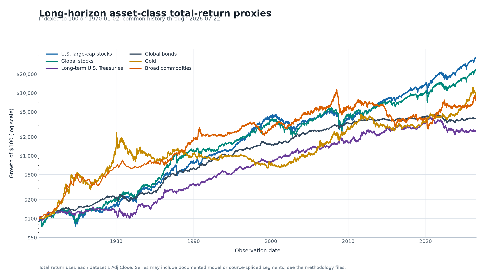

# Financial Datasets

[](https://github.com/mwilczynska/financial_datasets/actions/workflows/validation.yml)

Long-horizon daily asset-class datasets for Python portfolio backtesting.

This repository publishes generated CSV and Parquet outputs for a set of
long-history asset-class proxies. The public data lives under data/processed/
Most datasets begin on 1970-01-02, the first trading observation after the
1970-01-01 target. CPI begins on 1970-01-01 because it is calendar-daily.
The table below reports the first observation in each published processed CSV.

Maintainer: mwilczynska
Public repository: https://github.com/mwilczynska/financial_datasets



The chart compares six unlevered total-return proxies over their common
published history. Levels are rebased to 100 and shown on a logarithmic scale;
modeled and source-spliced periods remain subject to each dataset's methodology.

## Quick start

Load a published Parquet file and calculate daily total returns from its
Yahoo-compatible adjusted-close column:

```python
import pandas as pd

prices = pd.read_parquet(
    "data/processed/us_large_cap_sp500.parquet",
    columns=["Date", "Adj Close"],
).set_index("Date")
daily_total_return = prices["Adj Close"].pct_change()
```
## What this project does

The pipeline extends short live histories into long-horizon daily research
series. Where observed history is unavailable, it uses a documented source
chain, reconstruction, or model. Every row carries provenance-oriented fields
such as Source and Quality Flag where the dataset contract supports them.

These files are research datasets, not claims of official index history. Read
the methodology before interpreting a model-derived or source-spliced segment.
In particular, reconstructed total return must not be treated as raw observed
total-return index data.

## Published datasets

Each row below links directly to the public CSV and Parquet files and to the
dataset methodology. The CSV and Parquet versions contain the same processed
dataset in different formats.

| Alias | Dataset | Start date | End date | CSV | Parquet | Methodology |
|---|---|---|---|---|---|---|
| USLCAP | U.S. large-cap equity / S&P 500-like series | 1970-01-02 | 2026-09-28 | [CSV](data/processed/us_large_cap_sp500.csv) | [Parquet](data/processed/us_large_cap_sp500.parquet) | [USLCAP](docs/methodology_uslcap.md) |
| USLCAP3X | 3x daily-reset U.S. large-cap series | 1970-01-02 | 2026-09-28 | [CSV](data/processed/us_large_cap_3x_sp500.csv) | [Parquet](data/processed/us_large_cap_3x_sp500.parquet) | [USLCAP3X](docs/methodology_uslcap3x.md) |
| STT | Short-term U.S. Treasury, SHY-like | 1970-01-02 | 2026-09-28 | [CSV](data/processed/short_term_us_treasury.csv) | [Parquet](data/processed/short_term_us_treasury.parquet) | [STT](docs/methodology_stt.md) |
| ITT | Intermediate-term U.S. Treasury, IEF-like | 1970-01-02 | 2026-09-28 | [CSV](data/processed/intermediate_term_us_treasury.csv) | [Parquet](data/processed/intermediate_term_us_treasury.parquet) | [ITT](docs/methodology_itt.md) |
| ITT3X | 3x daily-reset intermediate-term Treasury, TYD-like | 1970-01-02 | 2026-09-28 | [CSV](data/processed/intermediate_term_us_treasury_3x.csv) | [Parquet](data/processed/intermediate_term_us_treasury_3x.parquet) | [ITT3X](docs/methodology_itt3x.md) |
| LTT | Long-term U.S. Treasury, TLT-like | 1970-01-02 | 2026-09-28 | [CSV](data/processed/long_term_us_treasury.csv) | [Parquet](data/processed/long_term_us_treasury.parquet) | [LTT](docs/methodology_ltt.md) |
| LTT3X | 3x daily-reset long-term Treasury, TMF-like | 1970-01-02 | 2026-09-28 | [CSV](data/processed/long_term_us_treasury_3x.csv) | [Parquet](data/processed/long_term_us_treasury_3x.parquet) | [LTT3X](docs/methodology_ltt3x.md) |
| GOLDPM | Gold spot with a GLD-tracking adjusted series | 1970-01-02 | 2026-09-28 | [CSV](data/processed/gold.csv) | [Parquet](data/processed/gold.parquet) | [GOLDPM](docs/methodology_goldpm.md) |
| GOLD2X | 2x daily-reset gold, UGL-like | 1970-01-02 | 2026-09-28 | [CSV](data/processed/gold_2x.csv) | [Parquet](data/processed/gold_2x.parquet) | [GOLD2X](docs/methodology_gold2x.md) |
| CMDTY | Broad commodities, DBC-like | 1970-01-02 | 2026-09-28 | [CSV](data/processed/broad_commodities.csv) | [Parquet](data/processed/broad_commodities.parquet) | [CMDTY](docs/methodology_cmdty.md) |
| CPI | U.S. CPI-U daily model-derived deflator | 1970-01-01 | 2026-09-28 | [CSV](data/processed/cpi_inflation.csv) | [Parquet](data/processed/cpi_inflation.parquet) | [CPI](docs/methodology_cpi.md) |
| GLSTOCK | Global all-world stocks proxy | 1970-01-02 | 2026-09-28 | [CSV](data/processed/global_stocks.csv) | [Parquet](data/processed/global_stocks.parquet) | [GLSTOCK](docs/methodology_glstock.md) |
| GLBOND | Unhedged global bonds proxy | 1970-01-02 | 2026-09-28 | [CSV](data/processed/global_bonds.csv) | [Parquet](data/processed/global_bonds.parquet) | [GLBOND](docs/methodology_glbond.md) |
| GLSTBOND | Unhedged global short-term government bonds proxy | 1970-01-02 | 2026-09-28 | [CSV](data/processed/global_short_term_bonds.csv) | [Parquet](data/processed/global_short_term_bonds.parquet) | [GLSTBOND](docs/methodology_glstbond.md) |

The daily workflow regenerates these start and end dates from the processed
CSVs after validation and commits the README alongside changed datasets.
End dates are the latest observations currently included in the processed
files. They can be updated through the documented update scripts as soon as
the underlying sources publish newer observations, often immediately for daily
sources, but later for delayed, monthly, or static sources. End dates may
therefore differ across datasets and from the date on which an update is run.

## Dataset methodology

The Methodology link in the table above points to the corresponding document
under [docs/](docs/). It explains how each dataset was built, including its
asset definition, start date, source chain, transformations, update path,
validation checks, and known caveats. Shared output and return conventions
are described in [docs/methodology.md](docs/methodology.md), and the complete
methodology index is [docs/dataset_methodologies.md](docs/dataset_methodologies.md).

## Output contract

The preferred leading columns are Date, Open, High, Low, Close, Adj Close,
and Volume, followed by project-specific fields such as Price Return, Total
Return, Source, Quality Flag, and Source Notes.

Close represents the price-return level or the best available close-level
proxy. Adj Close represents total return when that interpretation is
defensible. For model-derived datasets, the methodology file defines the
precise meaning. Open, High, Low, and Volume may be empty for reconstructed
index-level segments.

## How the files were created

1. Source acquisition: build scripts fetch approved public or primary-source
   inputs and save local downloads under sources/raw/ for reproducibility.
2. Normalization: source-specific parsers convert dates, levels, returns,
   calendars, and missing values to the project contract.
3. Source chaining: older modeled or proxy segments are joined to later
   observed fund, ETF, index, or API segments without resetting levels at
   boundaries. Quality Flag identifies the segment where available.
4. Output writing: each build writes processed CSV/Parquet outputs and
   build metadata under sources/manifests/. Interim artifacts are local-only and not published.
5. Validation: tests check schema, date coverage, level positivity, return
   arithmetic, duplicate dates, segment behavior, and independent-source
   agreement.

The public release includes the generated outputs and small validation
fixtures. Downloaded source caches under sources/raw/ are intentionally kept
out of the public file set unless their source terms explicitly permit
publication. Full builders fetch them when needed; ordinary updates use the
committed processed files as their baseline and fetch only recent observations.

## How to update the datasets

Install dependencies:

    python -m pip install -r requirements.txt

Refresh the complete dependency graph. The end date is inclusive:

    python src/update_all_datasets.py --end-date YYYY-MM-DD

This extends all 14 datasets from their committed processed CSVs. It fetches a
14-calendar-day overlap, checks for revisions, appends new days, and rewrites
CSV/Parquet together. CPI can revise recently carried-forward daily values when
BLS releases a new monthly observation. The normal path does not reconstruct
history or require excluded `sources/raw/` files. Use `--full-rebuild` only for
a deliberate historical reconstruction with its required raw sources.

Useful targeted commands:

    python src/update_all_datasets.py --only USLCAP GOLDPM GOLD2X
    python src/update_all_datasets.py --skip GLBOND GLSTBOND
    python src/update_all_datasets.py --refresh-static-sources

Use `--refresh-static-sources` only for a deliberate GLBOND/GLSTBOND full
rebuild. A requested end date can be later than the last
row when a market is closed, a source is delayed, or the source is monthly.

The [daily GitHub Actions workflow](.github/workflows/daily-refresh.yml) runs
at 09:17 New York time, targeting the previous calendar day. It runs the update,
validation tests, and [publication diff gate](scripts/check_daily_diff.py)
before committing an explicit list of processed CSV/Parquet and build metadata
files to `main`. A failure leaves `main` untouched and opens or comments on a
failure issue assigned to the repository owner. For email, watch this repository
and set GitHub **Settings → Notifications → System → Actions** to **Email** and
**Only notify for failed workflows**. This is a GitHub account setting for
watched repositories; the issue is the durable alert.
Use the workflow's manual **Run workflow** action with an optional `end_date`
to catch up. A delayed or missed scheduled run is caught up by the next run,
but GitHub cannot send a failure email for a run that never started. Monitor
the workflow externally if missed-run alerts are required.

To rebuild one dataset deliberately, run its build script. Its update script
performs the ordinary incremental path:

    python src/build_gold.py --end-date YYYY-MM-DD --root .
    python src/update_gold.py --end-date YYYY-MM-DD --root .

After an update, inspect the changed files and run:

    python -m pytest -q tests/validation tests/automation

For a local publication check after fetching new observations:

    python scripts/check_daily_diff.py --end-date YYYY-MM-DD

To regenerate the README chart and the 1280 x 640 social-preview asset:

    python -m pip install -r requirements-visuals.txt
    python src/create_readme_chart.py
    python src/create_social_preview.py

## Repository map

- [src](src/): build and update scripts.
- [data/processed](data/processed/): final public CSV and Parquet outputs.
- [docs/dataset_methodologies.md](docs/dataset_methodologies.md): methodology index.
- [docs/source_registry.md](docs/source_registry.md): source classification and provenance.
- [docs/validation.md](docs/validation.md): validation requirements and caveats.
- [sources/manifests](sources/manifests/): machine-readable source and build metadata.
- [sources/citations](sources/citations/): human-readable source notes.
- [tests/validation](tests/validation/): contract and regression tests.

## Data rights

There is no blanket data license. MIT applies to original source code only.
Published outputs can incorporate third-party data, and model-derived files
can inherit restrictions from their inputs. Review [DATA_LICENSE.md](DATA_LICENSE.md),
the relevant manifest, and the relevant citation note before redistributing
or using any output commercially.

## Privacy and security

The public project identity is the GitHub handle mwilczynska. Do not add
personal email addresses, real-name identities, local filesystem paths,
credentials, private project references, or private profile details. See
[SECURITY.md](SECURITY.md).
