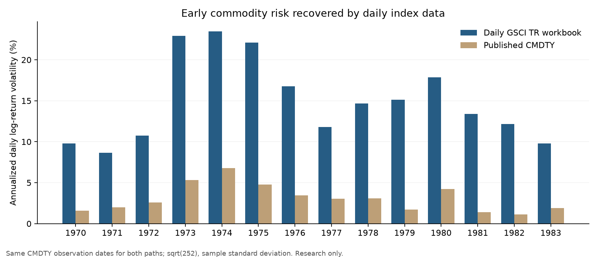

# CMDTY: daily 1970s GSCI history acquired

Research date: 2026-09-30. This follow-up supersedes the missing-data conclusion
and two-part source recommendation in [the original study](cmdty_daily_reconstruction.md).
This report records the pre-implementation research baseline. The subsequent
migration replaced the production CSV/Parquet and builder with paired
daily GSCI ER/TR. See [the implemented methodology](../methodology_cmdty.md)
and [Astra's implementation review](cmdty_daily_implementation_astra_review.md).
Vendor and derived-publication rights remain unverified.

## Finding and recommendation

A public university project contains a downloadable workbook with **daily GSCI
Spot, Excess Return and Total Return from 1970-01-02 through 2025-12-31**.
It contains 14,609 weekday rows, including **2,607 rows for 1970–1979** and
5,738 for 1970–1991. We downloaded the actual file and inspected its contents;
this is no longer a vendor coverage claim or a proposed acquisition route.

Prefer this source for the research candidate replacing both early GSCI
segments. Use its **ER** series for `Close` and its **TR** series for `Adj Close`,
each normalized at the common starting date. This avoids reconstructing roll
returns from incomplete constituents and avoids stripping approximate IRX
collateral from already collateralized TR. Retain the futures archives as
independent input checks and as a fallback if a source defect emerges.

The workbook is posted in the Paris Dauphine MSc commodity project
[Trading_Commo](https://github.com/yessinemx/Trading_Commo), whose authors identify
Bloomberg as its source. The acquired snapshot is commit
`f5ecf1507fb9cc98ffcc1f69c217793f5f9272a3`, dated 2026-05-26.
The [pinned workbook](https://raw.githubusercontent.com/yessinemx/Trading_Commo/f5ecf1507fb9cc98ffcc1f69c217793f5f9272a3/data/GSCI_Data.xlsx)
is 442,834 bytes; SHA-256:

```text
918e4046300180e0274781bfa6f1f5dcf2dc7df61b9229f9d4a9ea124da2a9f8
```

Local cache: `sources/raw/cmdty_1970s_research/trading_commo_data.xlsx`.
No terminal subscription or manual download was needed to acquire it.

## Provenance and calendar

We inspected the project's notebook and configuration as text, without running
downloaded code. Its historical request uses `PX_LAST`, daily periodicity and
the tickers `SPGSCI Index`, `SPGSCIP Index`, and `SPGSCITR Index`. It requests
previous-value filling on non-trading weekdays. The loader reads the existing
Excel file or requests Bloomberg data; the inspected loading code contains no
random-price fallback or interval interpolation. This supports the authors'
source description, but does not authenticate their terminal session or grant
rights to republish Bloomberg/S&P data.
[Pinned provenance code](https://github.com/yessinemx/Trading_Commo/blob/f5ecf1507fb9cc98ffcc1f69c217793f5f9272a3/notebook/main.ipynb).

The file has the complete Monday–Friday calendar for its coverage, including
holidays carried forward by the source. It has no duplicate dates, missing or
nonfinite prices, or nonpositive levels. These are **weekday observations**,
not 14,609 independently observed trading sessions. Early index levels are
rounded; a zero return alone cannot identify a holiday.

For a future importer, retain the complete source calendar and its fill
qualification. If CMDTY's existing observation calendar is retained, sample
the ER and TR **levels** at those dates and recompute consecutive level ratios.
This preserves changes across skipped dates. Do not select or drop returns
first, do not remove every flat day, and do not add new collateral to TR.
If a trading-only calendar is chosen, obtain an appropriate historical index
calendar rather than inferring sessions from nonzero price changes.

## Checks against other deliveries and published references

The checks use independently acquired files or published reference tables.
Their upstream index calculations may share a source; separate delivery does
not establish upstream independence.

| Check | Acquired evidence | Result |
|---|---|---|
| 1970s daily TR path | Public portfolio database, 2,607 matching dates | Maximum level difference 5.68e-13; all 2,606 consecutive log returns match within 1e-7 |
| 1970s month ends | Goldman/Duke workbook, 120 monthly observations for each index type | All 360 Spot/ER/TR values match exactly |
| 1970–1991 annual TR | Kaplan/Lummer published table, 22 years | Every return matches to published two-decimal percentage precision |
| Dated TR levels, 1970–1991 | SEC notice, 22 specified dates | Every level matches to published precision |
| 1979-12-27–1991-12-31 daily TR | User's Investing export, 3,035 shared dates | Maximum level difference 0.001; common-interval log-return RMSE 0.000458 bp |
| 1980–1991 public TR delivery | Quantpedia CSV | Confirms the same later daily history, with minor display precision differences |

The older Goldman file was downloaded from
[Campbell Harvey's public Duke course directory](https://people.duke.edu/~charvey/Teaching/BA453_2005/GSCI_0406.xls).
Its 1970–1991 monthly comparison has 264 dates per index type; maximum absolute
differences are 0.00059 for TR and under 0.00005 for ER and Spot. It is a monthly
source, not an alternative daily dataset. Its constituent-weight worksheet
does not consistently sum to one in the early period: January 1970 sums to
0.951486 and 72 of 120 months differ from one by more than 1%. It must not be
silently treated as validated portfolio weights.

The annual reference is Kaplan and Lummer, *GSCI Collateralized Futures as a
Hedging and Diversification Tool for Institutional Portfolios*, Appendix A,
[PDF page 13](https://www.etf.com/docs/20040913_GSCI.pdf).
The dated level reference is
[SEC Release 34-53658, PDF pages 29–30](https://www.sec.gov/files/rules/sro/nyse/2006/34-53658.pdf).
These references support the TR identity and historical endpoints; they do not
independently prove every daily 1970s value.

The portfolio database is available through the public Git LFS object of
[portfolio-allocation-app](https://github.com/federicogarzarelli/portfolio-allocation-app/blob/master/myPortfolio.db).
The same object was unavailable through the author's other repository; using
the app repository's normal public LFS download operation succeeded. Its
465,248,256 bytes match the advertised SHA-256 object identifier
`deecf9a9cca87f79f60543b1390ed731f6553782bd4f456038f152141d37faed`.
We queried SQLite in read-only mode. Its `COM` series starts 1970-01-01 and ends
2020-06-05; the initial January 1 value is outside the preferred workbook's
coverage and must not extend CMDTY's start date.

Although its entire 1970s path agrees to numerical precision, the database has
uncertain original-source metadata and later daily discrepancies and level
drift. The author's source-cleaning code explicitly filters extreme log
returns and rebuilds levels. We have not proved that this code produced every
database value. Use this file as corroboration, not as the preferred replacement.
The academic workbook has clearer index-type provenance and matches both
older monthly history and the later Investing delivery.

## What the daily path changes

These comparisons sample both acquired TR and pre-migration CMDTY on the **same
CMDTY dates**, so weekday-filled source holidays do not depress one path's
volatility relative to the other. Annualization is sample log-return standard
deviation times sqrt(252). Some common intervals span more than one calendar
day; these are comparisons on the existing CMDTY observation calendar.

| Statistic | Daily TR, 1970–1979 | Pre-migration CMDTY, 1970–1979 | Daily TR, 1970–1983 | Pre-migration CMDTY, 1970–1983 |
|---|---:|---:|---:|---:|
| Return intervals | 2,487 | 2,487 | 3,485 | 3,485 |
| Annualized volatility | 16.50% | 4.01% | 15.74% | 3.70% |
| Lag-one log-return autocorrelation | 0.035 | 0.627 | 0.033 | 0.637 |
| Maximum drawdown | −41.99% | −35.28% | −41.99% | −35.28% |
| Drawdown trough date | 1977-08-15 | 1976-11-01 | 1977-08-15 | 1976-11-01 |

The 1970s daily common-interval correlation with pre-migration CMDTY is only 0.203;
log-return RMSE is 101.86 bp. Both grow strongly across the decade, but its
smoothing misses most daily risk and shifts the main drawdown trough by more
than nine months. The acquired 1970s TR series ends at 686.56 from a base of
100; pre-migration CMDTY ends at 669.27. The original sparse anchor cache is still absent, so
the reason for the level difference has not been established.



For 1984–1990, the prior spot-based shape is already close to daily TR: correlation
0.9903 and log-return RMSE 13.69 bp. Direct ER/TR remains preferable because
it supplies daily futures carry and collateral without the sparse-anchor
overlay. That period's replacement is a smaller daily-shape improvement than
the 1970s replacement.

Using the companion ER series also matters. On 1991-01-02, the acquired TR/ER
ratio is **5.11696**, while pre-migration CMDTY's `Adj Close`/`Close` ratio is
**2.96469**, both starting at one in 1970. This confirms a large discrepancy in
the cumulative TR-to-ER uplift previously inferred by IRX stripping. The original
study documents omitted calendar days; bill-yield conventions and other model
differences can also contribute. This ratio does not attribute the entire
discrepancy to weekends, and it is not an additional return to add to TR.

## Other routes investigated

- Investing's daily GSCI TR starts 1979-12-27. The user also tested early daily
  live cattle and weekly GSCI TR: neither supplied earlier 1970s history.
- Quantpedia's directly downloadable TR CSV starts 1980-01-02. All 3,032 shared
  observations match the user's export exactly; it alone cannot fill the 1970s.
- An additional TurtleTrader feeder-cattle archive was acquired. Actual daily
  coverage begins 1973-09-06. Feeder cattle is not live cattle and does not
  solve the initial dominant cattle exposure.
- Hong/Yogo and Christiano public replication archives were acquired and
  inspected; the delivered commodity datasets are monthly. Their publication
  descriptions of underlying daily inputs are not public daily-price delivery.
- RealVol advertises live-cattle underlying history from 1966, but the public
  chart's referenced CSV returned 404. No underlying data was acquired.
- Norgate advertises GSCI TR/Spot from 1970, but its free trial contains only
  two years. This is a vendor claim, not an acquired source.
- CME yearbooks, government studies and chart archives were investigated.
  No complete usable daily 1970s dataset was obtained through those routes.
  They are unnecessary for the preferred direct-index candidate now acquired.

Raw downloads, discovery responses and retrieval-time sidecars remain in the
ignored research cache. The durable manifest records the principal acquired
sources and their hashes. No claim is made that the failed routes lacked data
in every possible edition or access channel.

## Promotion conditions and reproducibility

This research supports a direct daily-index replacement candidate for the
entire early GSCI segment. It does not establish that GSCI is equivalent to
DBC: production weights, historical admissions and roll rules still differ.
Pre-1991 history remains the index provider's back-calculation, rather than
contemporaneously published index observations. The SEC notice dates actual
index publication to May 1, 1991; the intended January 2, 1991 splice endpoint
is therefore still part of the provider's back-calculated history.

Before production integration, settle derived-publication rights, implement
explicit calendar treatment and source labels, and validate the 1991 splice
using ER and TR separately. Preserve later segment returns and recompute any
required level scaling at the boundary. Do not force the acquired direct
series through the old sparse levels. Keep the old published file as a
versioned baseline and investigate its level drift with the original anchor
cache if recovered.

The existing `DATA_LICENSE.md` applies. The public repository has no verified
grant permitting republication of upstream Bloomberg/S&P price history.
Raw data remain ignored; these artifacts publish research metrics, source
metadata and original audit code.

```powershell
python scripts\research_cmdty_full_history.py --download
python scripts\research_cmdty_full_history.py
```

The script uses pandas, NumPy, `openpyxl` and `xlrd`; matplotlib is optional.
The user's earlier Investing CSV is a required local input. The large public
database is optional corroboration and is not downloaded by this script.
All required reference dates and years are checked; missing or altered inputs,
nonfinite prices, an unexpected calendar, or a failed reference check stop the
audit. The manual Investing export's hash is also enforced, together with its
3,035-date overlap and maximum 0.001001 level-error gate; monthly comparisons
have explicit count and precision gates. Source files are identified by SHA-256. Production CSV and builder
hashes are compared before and after.

Outputs: `cmdty_full_history_findings.json`,
`cmdty_full_history_retrieval_manifest.json`, and
`cmdty_full_history_volatility.png` in this directory.
The [completed independent Astra Max review](cmdty_full_history_astra_review.md)
reproduced the raw-source results and all 44 published reference checks. It
identified the manual-input validation gap and the annual chart's omitted
first returns; both are corrected and verified. It supports the direct daily
ER/TR research candidate, subject to the documented production acceptance
conditions. That research did not change production CMDTY data or builder logic.
The subsequent implementation is complete and is documented in
[Astra's implementation review](cmdty_daily_implementation_astra_review.md).
