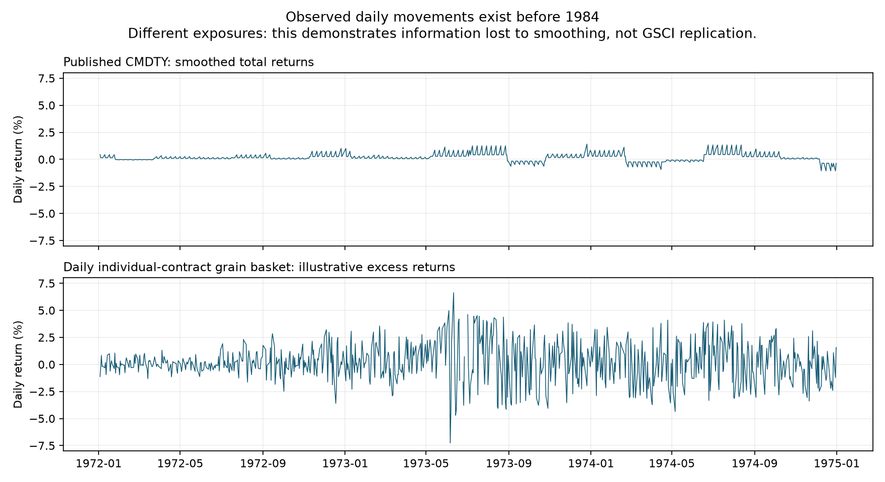
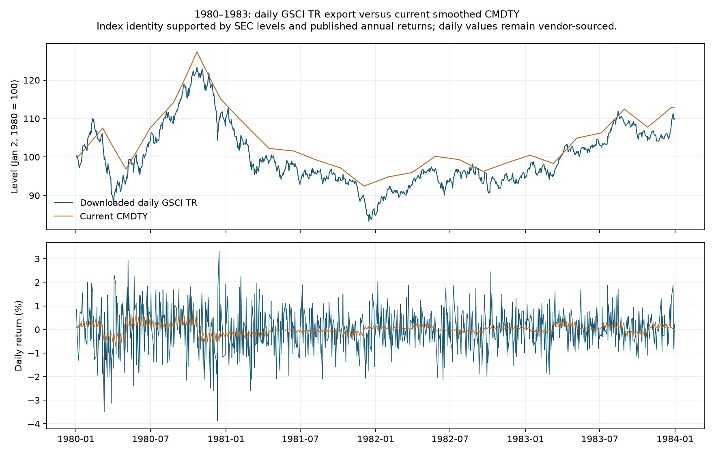

# CMDTY: replacing early smoothing with daily futures information

Research date: 2026-09-30. Scope: 1970-01-02 through 1991-01-02.
This is a research recommendation and reproducible feasibility study. The
production CMDTY series had not been replaced when this study was written.

**Follow-up:** the subsequent public-source search acquired full daily GSCI
Spot/ER/TR history from 1970 and corroborated the complete 1970s daily path.
See [the 1970s follow-up](cmdty_daily_1970s_followup.md) for the current source
recommendation and validation. The original feasibility analysis below is
retained; its missing-data conclusion and two-part recommendation are superseded.

**Implementation follow-up:** the production dataset now uses the paired
daily source through 1991-01-02. See [the current methodology](../methodology_cmdty.md)
and [Astra's implementation review](cmdty_daily_implementation_astra_review.md).
The comparisons and builder audit below describe the earlier version.

## Recommendation

Use a two-part upgrade. From **1979-12-27 onward**, prefer the daily GSCI Total
Return export obtained during this research, after source and daily-value
validation. Its identity is supported by independent published index levels and
annual returns. For **1970–1979**, build from daily individual futures contracts,
using the historical GSCI universe, documented weights, explicit rolls, and
calendar-day Treasury bill accrual. Use sparse TR levels to validate that
portfolio. If historical weights cannot be recovered, publish an estimated-weight
variant with uncertainty and an optional anchor-conditioned variant alongside it.

There is a feasible source route. I downloaded and parsed 14 freely linked
TurtleTrader archives. They contain individual contract histories, not just
continuous charts; corn, soybeans, wheat, cotton, and COMEX copper reach 1959.
The most important missing input is **live cattle**, for which CSI advertises
daily coverage from 1964-11-30. Early LME copper, cocoa, historical weights, and
historical roll rules also need acquisition or verification. This is a much
more specific problem than a general absence of pre-1984 daily commodity data.

An official daily GSCI Total Return extract covering the whole period would
still be the cleanest replacement and best validation target. S&P's own
publication discusses daily returns using history beginning in 1970. The user
obtained a third-party daily TR export from Investing.com for 1979–1991 after
the automated request and Chrome connector failed. A separate early-date check
confirmed that this page's data starts on December 27, 1979 despite its date
picker accepting earlier dates. Full daily 1970–1979 TR remains unacquired.
[S&P daily-history evidence](https://www.indexologyblog.com/2015/08/29/commodities-post-4th-biggest-2-day-gain-since-1970/).

## What the repository currently does

The builder is `src/build_broad_commodities.py`. Its historical chain is:

| Period | Current daily construction |
|---|---|
| 1970-01-02–1984-01-03 | Log-linear interpolation of sparse GSCI TR levels on the IRX observation calendar |
| 1984-01-04–1991-01-02 | Observed Yahoo GSCI spot returns plus a constant log-return adjustment within each sparse-anchor interval |
| 1991-01-03–2006-02-06 | BCOM returns plus project Treasury bill accrual |
| 2006-02-07 onward | DBC observed ETF returns |

Thus the entire 1970–1991 period is not equally smoothed. The priority is
1970–1983, followed by recovering daily futures carry in 1984–1991. The current
1984–1991 spot shape is already useful and should remain the comparison baseline
for that period.

The checkout contains the published processed data but none of the historical
CMDTY raw caches described by the methodology. I could audit published returns
and code, but could not independently check MacroMicro's underlying anchor
dates, series identity, or sampled levels. A replacement project should obtain
that cache and verify its identity against independent annual/monthly GSCI TR
values. Growth comparisons alone do not prove an index is the stated TR series.

Measured directly from the published CSV:

| Daily statistic | CMDTY 1970–1983 | CMDTY 1984–1990 |
|---|---:|---:|
| Return observations | 3,485 | 1,768 |
| Annualized standard deviation, sqrt(252) | 3.70% | 15.66% |
| Lag-one return autocorrelation | 0.637 | 0.099 |

The early interpolated series has substantial mechanical persistence. Its
nonzero volatility comes from changing interval slopes and the aggregation of
calendar-day interpolation across weekends; it does not recover observed daily
market volatility. This distorts daily risk estimates, volatility targeting,
rebalancing, and path-dependent backtests.



The second panel is an illustrative equal-weight grain excess-return basket,
not historical GSCI. Its 1970–1983 daily volatility is 21.28% and lag-one
autocorrelation is 0.025. These figures demonstrate the information present in
daily contract observations; they are not estimates of the correct GSCI risk.

## The early basket is not a modern energy-heavy basket

Research by Erb and Harvey identifies the original exposures as cattle, corn,
soybeans, and wheat, with cattle dominant during the first decade. Irwin,
Sanders, and Yan give historical admission years for the U.S. constituents:
sugar and silver 1973; hogs 1976; cotton 1977; gold 1978; coffee 1981; heating
oil 1983; cocoa 1984; WTI 1987; gasoline 1988.
[Erb and Harvey, pp. 11–12](https://people.duke.edu/~charvey/Research/Working_Papers/W77_The_tactical_and.pdf),
[Irwin, Sanders, and Yan, Table 1](https://scotthirwin.com/wp-content/uploads/2022/02/Irwin_Sanders_Yan_AEPP_All.pdf).

Bhardwaj, Janardanan, and Rouwenhorst report approximately 55% cattle and 22%
Chicago wheat in February 1970, and 33% sugar in 1974. Their text counts five
early commodities, whereas the preceding papers count four. This discrepancy
must be resolved against historical constituent records before exact
replication; it does not change the evidence that cattle was essential and
energy absent initially.
[Bhardwaj et al., introduction](https://www.sciencedirect.com/science/article/pii/S2405851320300349).

Consequences for this project:

- A gold/silver-only daily proxy is economically unsuitable for the earliest
  GSCI history, despite those prices being easy to obtain.
- A grain-only basket leaves the largest early exposure unobserved. Adding
  hogs or pork bellies does not turn them into observed cattle returns.
- Contract launch and index admission are different dates. Available WTI
  observations from 1983 do not justify a GSCI WTI weight before 1987.
- A retrospective modern DBC basket would be a different research asset. It
  cannot recreate energy futures before those markets existed. Preserving the
  existing early GSCI target is the more limited and defensible CMDTY upgrade.

## Daily sources: what was actually verified

### Free individual contracts: TurtleTrader

The publisher explicitly links free historical ASCII ZIP archives. I downloaded
the files, opened every archive member, parsed delivery identifiers and dates,
and audited their price records. Coverage below is **observed file coverage**,
not merely a claim on a landing page.
[Publisher and download links](https://www.turtletrader.com/hpd/).

| Commodity | Earliest parsed daily observation | Accepted delivery files | Relevance |
|---|---|---:|---|
| Corn | 1959-07-01 | 217 | Core early exposure |
| Soybeans | 1959-07-01 | 302 | Core early exposure |
| Chicago wheat | 1959-07-01 | 216 | Core early exposure |
| Sugar #11 | 1961-01-04 | 208 | Important after admission |
| Silver | 1963-06-13 | 272 | Precious metal exposure |
| Hogs | 1969-06-25 | 229 | Additional livestock exposure |
| Cotton | 1959-07-01 | 221 | Later agricultural exposure |
| Gold | 1974-12-31 | 213 | Available before GSCI admission |
| COMEX copper | 1959-07-01 | 319 | Proxy for missing LME observations; not identical |
| Heating oil | 1979-03-06 | 277 | Available before GSCI admission |
| WTI | 1983-03-30 | 235 | Available before GSCI admission |
| Coffee | 1973-08-17 | 148 | Available before GSCI admission |
| Pork bellies | 1963-01-22 | 195 | Optional diagnostic/control; not presumed GSCI membership |
| CRB index futures | 1986-06-12 | 84 | Does not solve the 1970s gap |

Most archives end in 2002; cotton extends into 2004. That is sufficient for the
target period and overlap experiments. Each delivery file has daily OHLC,
volume, and open interest. Headers and date formats change between files.
The download page does not establish that every `Close` is an exchange
settlement, identify every upstream vendor, or grant a blanket redistribution
license. Before production use, validate samples against a second source and
confirm the price convention and permitted derived use.

The inspection found concrete reasons to avoid a naive ZIP importer:

- The corn archive includes two cocoa files, `CC02Z.TXT` and `CC02U.TXT`.
- The hogs archive includes a cattle file, `LC02V.txt`, but this isolated 2002
  delivery does not supply early cattle history.
- Malformed identifiers such as `GC001F.txt` and `PB0801.TXT` are rejected.
- One heating-oil record has inconsistent OHLC. Several same-contract moves
  exceed 20%; they require checking against historical events and a second
  price source rather than automatic clipping.

Content hashes and coverage are in
[`cmdty_daily_source_inventory.csv`](cmdty_daily_source_inventory.csv).
Detailed exclusions and diagnostics are in
[`cmdty_daily_findings.json`](cmdty_daily_findings.json).
Downloaded observations stay in ignored `sources/raw/cmdty_daily_research/`.

### Missing constituents and independent verification

| Source | Verified evidence | Decision |
|---|---|---|
| CSI | Public current factsheet lists live cattle settlements from 1964-11-30 and `MCU3` LME three-month ring quotations from 1968-01-02; daily delivery-data products are documented | Preferred cattle acquisition lead; copper quotation coverage does not establish fixed prompt-date contracts |
| Cycle-Trader | Advertises daily cattle futures/cash for 1969–1997; catalog lists $100 per dataset on research date | Potential low-cost cattle source; inspect a sample first to establish individual deliveries versus continuous/cash data and adjustment rules |
| Pinnacle CLC | Advertises cattle from 1971 and grain histories around 1969–1970, with several linking choices | Useful later cross-check; misses 1970 cattle and does not by itself establish a GSCI roll-compatible panel |
| Norgate | Individual deliveries and settlements documented; general coverage starts around 1980 | Useful overlap validation; not a complete 1970 solution |
| CME DataMine | Official purchased historical products/API documented | Request exact coverage/sample for cattle and other gaps; this research did not establish a complete 1970 export |

[CSI cattle factsheet](https://apps.csidata.com/factsheets.php?exchangeid=CME&format=htmltable&type=commodity),
[CSI all-market CSV](https://apps.csidata.com/factsheets.php?type=commodity&format=csv),
[CSI delivery-data format](https://www.csidata.com/?page_id=2991),
[Cycle-Trader cattle](https://cycle-trader.com/data/live-cattle/),
[Cycle-Trader catalog](https://cycle-trader.com/catalog/),
[Pinnacle coverage](https://pinnacledata2.com/clc.html),
[Norgate futures package](https://norgatedata.com/futurespackage.php),
[CME DataMine API](https://www.cmegroup.com/datamine/datamine-api.html).

These are vendor coverage claims, not acquired/validated missing-price records.
No account was created, data purchased, or vendor contacted. CSI history depth
depends on subscription entitlement; the start date in its factsheet is not a
promise that a basic subscription supplies the entire history.
[CSI history entitlement](https://www.csidata.com/custserv/onlinehelp/OnlineManual/choosingthedatabase%28s%29toinstal.htm).

`MCU3` is specifically **Copper 3-Month (Ring)**, with no delivery-month list
in the factsheet. A daily rolling three-month quotation changes maturity each
day. It cannot by itself supply the same-contract price changes required for
held-position P&L. Acquire suitable prompt-date/curve or index-compatible
history and establish GSCI's historical LME reference-price convention; do not
treat this vendor start date as a solved copper contract panel.

### Index and collateral alternatives

Yahoo GSCI spot was successfully downloaded: 2,022 observations from
1984-01-03 through 1991-12-31. This is useful independent shape data and confirms
the existing 1984 boundary. The request and hash are recorded by the research
script. Investing's GSCI TR historical page returned HTTP 403 to a normal
request. The browser connector also failed before listing Chrome tabs with a
Windows sandbox setup error. The user supplied the export manually; its audit
and independent checks are described below.

Old CRB price indices and CRB index futures are different instruments. A daily
price index can help estimate common movements if its history and vintage are
verified, but it does not automatically provide an investable rolling-futures
return. In particular, the available TurtleTrader CRB futures start in 1986.
Monthly World Bank prices and monthly long-run academic baskets remain useful
cross-checks, but do not answer the daily-path problem by themselves.

For a publicly sourced collateral approximation, FRED `DTB3` is daily and on a
discount basis. It can replace fragile Yahoo rate access; it is a secondary
market rate, not the historical GSCI auction-rate convention.
[FRED series definition](https://fred.stlouisfed.org/series/DTB3).

### User-acquired daily GSCI TR: 1979–1991

The export contains **3,035 rows, 1979-12-27 through 1991-12-31**, with no
duplicate dates or weekend observations. All printed daily percentage changes
agree with consecutive `Price` changes within rounding tolerance. Annual
coverage is 252–253 observations. This is a daily export, rather than the
repository's roughly 57-day sampling.
[Requested historical page](https://www.investing.com/indices/sp-gsci-commodity-total-return-historical-data).

Two independent checks support **GSCI TR identity and scale**:

- Twelve dated early-January levels for 1980–1991 agree with the NYSE/Barclays
  historical GSCI TR table in a 2006 SEC filing within its two-decimal rounding.
  [SEC filing, pp. 29–30](https://www.sec.gov/rules/sro/nyse/2006/34-53658.pdf).
- Twelve annual returns for 1980–1991 agree within rounding with Kaplan and
  Lummer's 1997 Appendix A. Their preface and endnote 3 identify the official
  Goldman Sachs GSCI TR series. Examples are +11.08% in 1980, −23.01% in 1981,
  and +29.08% in 1990.
  [Kaplan and Lummer, Appendix A](https://www.etf.com/docs/20040913_GSCI.pdf).

These checks substantially strengthen identity verification. They are sparse
references, not an independent check of every daily observation. The export
contains index-style OHLC fields; use `Price` only rather than treating those
fields as genuine intraday trading ranges. Before 1991, GSCI itself is a
back-calculated index: a daily published level is not contemporaneous index
publication or proof of point-in-time investability.

The 1980–1983 TR export has **13.58% annualized daily volatility and 0.029
lag-one autocorrelation**. Current CMDTY has about 2.64% volatility and 0.654
autocorrelation on the common-date return intervals. To avoid discarding
unmatched days, comparisons first align levels to common close dates and then
compute returns; an intervening unmatched date remains inside the enclosing
return interval. The common-interval daily log-return RMSE is 84.5 bp and return
correlation is only 0.185. These figures directly quantify the information lost
to smoothing over part of the formerly unavailable period.



For 1984–1990, current CMDTY and the export have common-interval return
correlation 0.990 and daily log-return RMSE 13.7 bp. This confirms that the
existing spot shape already captures most daily variation. Nevertheless,
normalizing both on January 3, 1984 leaves current CMDTY **7.01% below** the
downloaded TR level by December 31, 1990: growth factors are 3.039 and 3.268.
This drift deserves investigation against the original sparse anchor cache and
the boundary defect below. It cannot be attributed to one cause from these
comparisons alone. Over the full 1984–1991 overlap, downloaded TR versus Yahoo
spot return correlation is 0.992; their growth factors differ markedly, as
expected for spot versus roll-inclusive, collateralized TR.

Preserve this CSV as an immutable, hashed raw snapshot. It is already TR:
**do not add bill interest to it again**. Prefer direct daily TR from its first
valid date rather than an endpoint bridge that would overwrite it with future
anchor information. Recover ER from a separately sourced ER index where
possible; otherwise strip collateral consistently, with an explicit estimated
ER flag. Do not retain today's calendar/accrual defect when doing so.
December 27 is the first available level; December 28 is the first return that
can be calculated entirely from two downloaded levels. Match the model and
direct source at a documented overlap close and use observed subsequent
ratios, rather than inventing a direct return on the initial source date.

Under the reference guide's collateral convention, the inverse calculation is:

```text
contract_daily_return = (TR[t] / TR[t-1]) /
                        (1 + daily_bill_return) ** non_index_days -
                        1 - daily_bill_return
```

Use the appropriate prior auction rate and historical convention. Substituting
a secondary-market yield makes this estimated ER, even when the input TR level
is directly sourced.

## Proposed construction

### Preferred path: a daily futures portfolio

Store actual prices keyed by commodity, exchange, delivery month, and
settlement date. Include multiplier, quote units, currency, and contract
changes. Retain provenance down to the file and original delivery identifier.

For yesterday's positions `q[j,k,t-1]`, contract multiplier `M[j]`, prices
`F[j,k,t]`, and portfolio value `V[t-1]`, calculate:

```text
futures_pnl[t] = sum(q[j,k,t-1] * M[j] *
                     (F[j,k,t] - F[j,k,t-1]))
excess_return[t] = futures_pnl[t] / V[t-1]
```

Equivalent notional weights must use the prices and positions at the beginning
of the return interval. Roll trades change the positions used for subsequent
returns. Futures are not bought by paying the full quoted contract price, so
the difference between old and new contract prices is not an immediate gain or
loss. Do not add a separate average annual roll yield to this P&L: changing
contracts and subsequent price convergence already enter the return path.

Use historical GSCI membership and contract-production weights if obtained.
Reproduce the relevant historical reference contracts, roll timing, and
disruption rules. The current S&P rules describe daily settlements and a
five-business-day roll beginning on the fifth business day; historical rules
must be checked before using that convention for 1970. Keep GSCI's quoted
futures-based spot index distinct from physical cash prices.
[Current S&P methodology](https://www.spglobal.com/spdji/en/documents/methodologies/methodology-sp-gsci.pdf).

Within a year, quantity/production weighting produces dollar-weight drift as
prices move. A fixed-weight daily-rebalanced portfolio is a different asset.
Likewise, ratio-adjusted continuous files can support the return path of their
particular roll rule, but cannot reproduce a different multi-day index roll
without the component contracts. Percentage changes of additive back-adjusted
levels use an artificial denominator. Unadjusted cross-contract price jumps
are also unsuitable investment returns. Norgate's explanation illustrates this
distinction.
[Continuous-contract adjustment explanation](https://norgatedata.com/futurespackage.php).

For a generic fully collateralized portfolio, add the bill accrual to futures
P&L using the actual elapsed calendar days and the rate available beforehand.
For exact GSCI replication, use its own collateral convention: the reference
guide converts the prior 91-day auction discount rate `d` to

```text
daily_bill_return = (1 / (1 - d * 91 / 360)) ** (1 / 91) - 1
TR_factor = (1 + contract_daily_return + daily_bill_return) *
            (1 + daily_bill_return) ** non_index_days_since_previous_close
```

`d` is a decimal rate. FRED secondary-market rates substituted into this formula
give an approximation, not official GSCI TR.
[S&P reference guide, p. 11](https://www.spglobal.com/spdji/en/documents/methodologies/methodology-sp-gsci-quick-guide.pdf).

With observed contracts and established weights, the daily path no longer
depends on sparse GSCI return anchors. Normalize its ER and TR levels to 100
and retain separate quality flags for exact documented inputs and estimated
weights/proxies.

### If historical weights are unavailable

Retrieve historical CPWs/annual dollar weights and the 1991 back-calculation
methodology first. The current factsheet is insufficient. Research figures can
supply broad priors, but digitizing a chart does not produce exact weights.

A practical estimate would fit **slowly changing, nonnegative constituent
weights** within a historically admissible universe. Use annual/era priors,
regularize changes, and account for price-driven weight drift. Production
quantity data may inform priors, provided units, production definitions, and
historical availability are established. This research has not recovered the
historical CPWs or validated that approximation.

Sparse index returns provide a small number of noisy aggregate constraints:
around six per year at the repository's stated sampling frequency. They cannot
identify many independently varying monthly weights, daily carry residuals,
and unobserved constituent returns simultaneously. Do not fit a free daily
weight path or force a grain portfolio to stand in for missing cattle. Estimate
over sufficiently long windows and report sensitivity to plausible weights.

An independently observed daily index can calibrate missing exposures during
an overlap period, but a 1980s regression is not a 1970s composition model.
The portfolio changes substantially across these eras. Acquiring cattle is
more valuable than a more elaborate regression on the wrong commodity set.

### Optional interim path: an anchor-conditioned daily estimate

If retaining the existing GSCI TR endpoints is a project requirement, start
with daily portfolio log returns `p[t]`, including a consistent collateral
model. For an interval `(a,b]`, let `G = log(A[b]/A[a])` and
`D = G - sum(p[t])`. The simplest bridge is:

```text
estimated_log_return[t] = p[t] + D / N
```

This changes the interval's drift while preserving daily differences in the
observed-data proxy. It is a coherent constrained estimate, not the observed
GSCI daily path. All daily returns within the interval use the future endpoint;
the result is an ex-post reconstruction and is unsuitable as point-in-time
information for trading signals.

A more general minimum-adjustment bridge is:

```text
adjustment = Sigma @ ones / (ones.T @ Sigma @ ones) * D
```

Here `Sigma` describes **proxy-error covariance**, estimated on an independent
overlap, not just market-return variance. Independent equal error variances
give the constant bridge. Larger uncertainty can receive more correction, but
arbitrary volatility weights could alter event timing without improving
accuracy. Soft/noisy endpoint constraints are preferable when anchor identity,
timestamps, or values are uncertain.

Never allocate a complete anchor movement to only the portion inside a source
segment. Bridge full intervals first, then slice the result at a splice. Treat
exact anchor dates consistently: the return ending at an anchor belongs to
the interval that ends there. Do not silently interpolate an anchor onto a
different calendar date and claim exact endpoint matching.

For incomplete constituent coverage, a conditional-mean estimate will miss
unexplained volatility. Publish residual uncertainty or ensemble scenarios
separately. Random noise chosen to match annual volatility does not recover
historical events and should not become the main CMDTY series.

## Empirical feasibility experiment

I constructed illustrative rolling returns from daily individual contracts
using two-contract P&L and a fixed calendar roll. Current reference-month
schedules were used for this experiment, **not claimed as verified historical
GSCI rules**. Inputs are corn, soybeans, wheat, sugar, silver, hogs, cotton,
gold, heating oil, WTI, and coffee. Cattle, LME copper, cocoa, and gasoline are
missing from this diagnostic model.

For each of 1987, 1988, 1989, and 1990, I fitted a ridge regression of observed
GSCI spot daily returns on the available futures returns using only earlier
dates. The penalty was fixed at 10 on predictors scaled using training data.
The diagnostic coefficients are unrestricted and are not portfolio weights.
Then I hid the validation year's daily spot path behind approximately 40-row
endpoint blocks and compared smoothing with an endpoint-conditioned daily
prediction. Both methods receive identical endpoints on the **full observed
index calendar**; grains and multisector comparisons use the same dates. Where
the multisector predictor set is incomplete, the experiment explicitly assumes
a zero predicted log return before applying the common drift bridge. This is a
diagnostic fallback, not an observed zero futures return or a recommended
production imputation. The JSON records every affected date and its true index
return. Raw correlations use complete prediction dates only. Endpoints are
synthetic, not MacroMicro's actual timestamps.

| Held-out year | Complete / all test dates | Raw daily correlation | Smoothing daily log-return RMSE | Daily-data bridge RMSE | RMSE reduction |
|---|---:|---:|---:|---:|---:|
| 1987 | 249 / 253 | 0.799 | 78.0 bp | 47.7 bp | 38.8% |
| 1988 | 251 / 253 | 0.900 | 93.5 bp | 43.6 bp | 53.3% |
| 1989 | 248 / 252 | 0.879 | 76.0 bp | 38.3 bp | 49.6% |
| 1990 | 245 / 252 | 0.946 | 168.6 bp | 91.9 bp | 45.5% |

Astra found that the original experiment dropped incomplete dates before
constructing endpoints. In 1990 this changed the target growth from +6.14% to
−3.40%. The script and table above now preserve the full target path; maximum
block-end log error is below 3e-17. The repaired results agree with Astra's
independent full-calendar calculation. This correction illustrates why
complete-case daily correlations and cumulative-path validation are different
tests.

This establishes that available daily futures information can materially
improve on interval smoothing in an observable overlap. It does **not** prove
the same error reduction in 1970–1983, validate historical GSCI TR carry, or
beat the repository's existing observed GSCI spot shape in 1984–1991. The
experiment targets independently downloaded **spot**. The subsequent user TR
export provides the separate direct-source checks above; it is not silently
substituted into this experiment.

The grain-only comparison performed much worse: correlations of approximately
0.21–0.37 and only 2–6% RMSE reductions. The multisector model also missed risk:
in 1990 its bridged annualized log-return volatility was 15.41%, versus 27.46%
for the observed target. Strong daily correlation is not sufficient; correct
exposures and scale matter. This is evidence for acquiring missing constituents
and historical weights, rather than promoting the incomplete regression.

## Two implementation issues to address with the upgrade

1. **Collateral omits weekends and holidays.** `daily_collateral(day)` applies
   one `rate/365` increment per observation and uses that day's rate. Over the
   published 1970–1991 early segment, the implied collateral factor is 2.965.
   Reapplying those same implied rates across actual gaps gives 4.891, with
   2,416 additional calendar days. This is a sensitivity calculation, not an
   official corrected factor. Early `Adj Close` is already TR-anchored, so the
   immediate effect there is the inferred ER `Close`; one must not add missing
   collateral to already anchored TR. The later BCOM TR model also needs a
   consistent calendar-day convention.
2. **Partial anchor intervals receive complete interval targets.** The Segment
   1 grouping uses the entire anchor-to-anchor log change even when only part
   of that interval lies inside Segment 1. A synthetic run of the actual
   builder, with flat spot prices and a 10% anchor change ending January 12,
   allocated the entire change by January 9 when that was the shape segment's
   final date. Exact anchor days also enter the following bucket. The real
   historical magnitude cannot be quantified without the original anchor
   cache. Fix by constructing full intervals and slicing only afterward.

The research script reproduces the second issue with synthetic inputs and
records its result; no production code was changed to fix it during this task.

## Implementation sequence and acceptance gates

1. Validate and preserve the acquired 1979–1991 daily TR export; obtain the
   existing sparse anchor cache to investigate level drift. Check daily samples
   and extreme events against a second daily source. Seek `SPGSCITR`/the
   confirmed vendor equivalent for 1970–1979, with index-version metadata.
   A full direct extract would remove the need to reconstruct constituents.
2. If the 1970s daily extract remains unavailable, acquire cattle individual
   deliveries for 1969–1991, with a sample around
   1970 and an overlap in the 1980s. Confirm settlement convention, raw prices,
   units, delivery identifiers, and permitted derived use. CSI is the most
   concrete lead; Cycle-Trader is a potentially cheaper alternative pending
   sample inspection. Do not substitute hogs as if they were cattle.
3. Recover historical universe/weights/roll documentation. Resolve the four
   versus five initial-constituent discrepancy and extinct/changed contracts.
   Acquire suitable LME prompt/reference-price data and the remaining admitted
   constituents as required. Prioritize the unresolved 1970s; the 1980s can
   supply a validation overlap without replacing acquired daily TR with a model.
4. Build and audit the daily ER/TR portfolio independently of sparse anchors.
   Retain observed inputs and estimated assumptions as separate provenance.
5. Where exact historical rules are unavailable, compare a documented-weight
   approximation, an estimated-weight model, and an anchor-conditioned model.
   Select on independent evidence, not endpoint fit alone.
6. Validate daily TR against a separately sourced target where available.
   For the 1984–1991 overlap, also compare daily spot/sector movements and the
   existing CMDTY shape. Investigate roll-window differences rather than
   treating them as unexplained noise. Hold out contiguous eras and constituent
   transition years; do not randomly split daily rows.
7. Require better daily error and event timing than smoothing, plausible
   volatility and tails, reasonable drawdown/recovery dates, and stable results
   under weights/roll/calendar sensitivity. Verify no false roll gaps, future
   rate use, missing-price zero returns, or partial-interval target allocation.
   Establish numeric tolerances from an independently validated target before
   promoting data; a volatility floor and 5% sparse-level tolerance are weak
   acceptance tests by themselves.

Check 1972–1974 agriculture, the 1974 sugar episode, 1979–1980 metals, the 1986
energy decline, the 1987 WTI admission, and 1990 energy stress. Review these
episodes only in the exposures that the historical basket actually held.
Produce comparisons of realistic backtests, including volatility targeting
and periodic rebalancing, as a consequence check after return validation.

## Reproduction and artifacts

```powershell
python scripts\research_cmdty_daily.py --download
python scripts\research_cmdty_daily.py
```

The first command fetches missing public archives and the Yahoo spot comparison
into ignored caches. The second reproduces offline once those inputs exist;
it now fails clearly if any of the 14 archives or the Yahoo comparison is absent.
The manually acquired TR CSV is separately required to reproduce its audit and
figure: retain it as
`sources/raw/cmdty_daily_research/investing_gsci_tr_1979_1991.csv`. It is not
automatically downloaded and its absence skips only that explicitly optional
source audit.
Neither changes `data/processed/` or invokes a production historical rebuild.
The published CMDTY CSV hash and raw file hashes are recorded, so a later
dataset revision is distinguishable from the research baseline.
The retrieval manifest records URLs, hashes, coverage, and cached source pages,
including the CSI factsheet. Initial fetch timestamps were not retained: their
documented research access date is recorded explicitly, with exact timestamp
left null rather than inferred from mutable file modification times. Future
script downloads save retrieval-time sidecars. Python, NumPy, pandas, script,
and production-builder versions/hashes are recorded in the findings.

The script requires pandas/numpy already used by this project; the optional
figure requires matplotlib. Source summaries are aggregate metadata, not a
redistribution of downloaded daily observations. Raw access permission and
derived-publication permission remain separate, as described in
[`DATA_LICENSE.md`](../../DATA_LICENSE.md).

Files produced:

- `docs/research/cmdty_daily_findings.json`: numerical results, hashes, source
  exclusions, collateral sensitivity, and synthetic boundary demonstration.
- `docs/research/cmdty_daily_source_inventory.csv`: observed archive coverage.
- `docs/research/cmdty_daily_retrieval_manifest.json`: durable source metadata.
- `docs/research/cmdty_daily_vs_smoothing.png`: illustrative daily-path comparison.
- `docs/research/cmdty_daily_tr_validation.png`: direct TR versus current CMDTY.
- `scripts/research_cmdty_daily.py`: downloader, parser, P&L experiment, and audits.

## Independent review

The requested **Astra Max** review is in
[`cmdty_daily_astra_review.md`](cmdty_daily_astra_review.md). It independently
reproduced the results and all 14 archive hashes, confirmed the portfolio and
collateral reasoning, and identified the calendar-compression flaw repaired
above. Its copper-source and provenance qualifications were also incorporated.
The follow-up review independently verified the user's new daily TR export,
all 24 reference checks, and the volatility/error/level comparisons. It found
no new material numerical error and supports the two-part recommendation:
direct-source TR returns from December 28, 1979, with December 27 as the
overlap level, and constituent reconstruction for the unresolved 1970s.
Independent daily-value sampling and implementation checks remain necessary
before production promotion. A production importer must reject nonfinite
prices and require every expected reference check; the research audit's
conditional reference selection is not a general production acceptance rule.
No production CMDTY data or builder logic was changed during this research.
